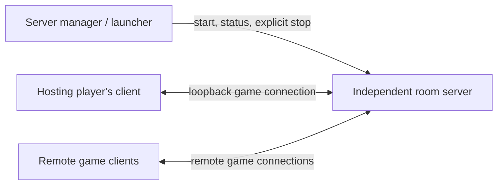

# Independent multiplayer server and commander recovery

Status: proposed; code inspected 2026-09-08. This document does not implement the split.

## Objective

Run the room server independently of every game client. The hosting player's client
connects over loopback; guests connect remotely using the same protocol. A client
crash must not terminate the room. Give any commander 30 seconds to reconnect,
including the hosting player, and support reconstructing a crashed client's match.

Related: [multiplayer behavior](MULTIPLAYER.md),
[observer implementation](MULTIPLAYER_OBSERVERS_PLAN.md), and
[mass-unit optimization](MASS_UNIT_OPTIMIZATION_PLAN.md).

## What already exists

- `redalert2/src/network/server/GameServer.ts` coordinates lobby state, orders,
  sync checks and history. It does not run the full game simulation; each commander
  simulates the match deterministically. Keep this architecture in the first release.
- Local hosting already uses the same network protocol as remote clients.
- macOS already launches a separate helper through
  `macos/Sources/MultiplayerHost.swift`. However, `redalert2/server/macos.ts`
  exits on stdin EOF, and native app lifecycle handlers stop the helper.
- Windows/Linux use `redalert2/server/electron.ts` inside `linux/main.js`.
  Window/app teardown stops hosting. This needs an independent process boundary.
- `GameServer.drop()` stops non-dedicated servers when `embeddedHostId` leaves,
  even if administration has transferred. Process isolation alone does not fix this.
- `ResumableChannel.ts`, `server/ResumableConnections.ts` and
  `client/WebSocketConnection.ts` preserve an existing client session across a
  temporary socket break: 30-second grace, 4 MiB / 2,048-message pending limits.
  This assumes the client still has its simulation and transport state in memory.
- Observer history is bounded to 64 MiB / 100,000 frames. When unavailable it
  disables observation; it cannot currently guarantee arbitrary late-match recovery.

## Proposed ownership

Separate three identities: server owner (management authority), room administrator
(settings/start/kick authority), and commander (simulation slot). Losing a commander
or administrator connection must not imply permission to shut down the process.
Never grant management authority merely because a game connection is local.

The server process owns its listener, timers, room, recovery records and replay
archive. A local manager can discover and reattach to an existing instance after
the game app restarts. Authenticate local management with a private capability;
keep it separate from player recovery credentials and out of logs/command lines.
Publish only the necessary game listener to remote peers.

Use a shared server entry point with platform launch adapters. The server must
survive renderer failure, full client-app termination and loss of its original IPC
pipe. Packaging must explicitly support macOS, Windows and Linux; do not assume
a detached spawn flag or Electron child automatically provides these guarantees.
Verify the packaged process behavior on each platform.

## Recovery contract

| Event | Proposed behavior |
| --- | --- |
| Temporary socket loss, simulation alive | Existing ordered transport resume; preserve commander and pending data. |
| Client fatal error / renderer or app crash | Reserve commander for 30 seconds; new client authenticates and reconstructs state. |
| Authenticated reconnect within grace | Enter a separate bounded recovery period; initial proposed catch-up limit 120 seconds, to validate on long matches and slower devices. |
| Grace or catch-up deadline expires | Commit the normal deterministic departure/AI policy exactly once. Fresh joins cannot reclaim the departed commander. |
| Explicit Leave Match / Leave Server | Release that client's participation intentionally; server remains alive. |
| Explicit authorized Stop Server | End the room and close clients cleanly; recovery credentials become invalid. |
| Server process crashes | Clients report server loss and retry within a bounded window; same-session recovery is unavailable without persisted server state. |

Use server monotonic deadlines. Repeated retries do not extend the original grace
or recovery limit. UI must distinguish reconnecting, rebuilding the match, expired
reservation and server loss. Do not classify a fatal client error as an intentional
quit; audit current error cleanup so it does not send a terminal leave accidentally.
Detection starts when the server observes the failure: an open-but-unresponsive
socket currently has a separate 120-second liveness policy. Specify and test its
interaction with the 30-second reservation instead of promising immediate detection.

### Rebuilding a commander

1. Issue a separate recovery credential bound to room instance, match generation
   and commander. Store it locally so app restart can recover it; rotate it on
   successful takeover and revoke it on leave, kick, expiry and match reset.
   A display name or slot number is never proof of ownership.
2. Keep same-socket-session resume distinct from reconstruction. A new process
   does not possess old ACK cursors, unsent orders or a valid live simulation.
   Fence the previous connection before accepting the replacement.
3. Establish a server-owned recovery barrier at a committed, agreed frame.
   Existing lockstep may already stall for the missing commander; explicitly
   define the barrier so no unresolved orders are silently treated as empty turns.
   Pause progression for recovery in the first version. Continuing with temporary
   AI would change gameplay and require a separate takeover design.
4. Recreate the original roster, commander identity, seed, options and verified
   content; replay only authoritative committed orders and lifecycle events to the
   barrier. Reuse observer replay mechanics, but do not add a spectator player or
   alter original player indexing, RNG state or hash inputs.
5. Suppress historical audio and player input while catching up. Compare the
   reconstructed hash with a trusted agreed checkpoint from surviving commanders.
   Define the no-surviving-commander case explicitly; the relay cannot independently
   certify a simulation hash. Do not claim server-side simulation validation.
6. Atomically resume participation at a defined next turn. Reconcile already
   committed and pending orders; discard local unsubmitted input from the crashed
   process. Fence late packets, duplicate recovery attempts and stale generations.

## Delivery phases

### 1. Independent process and lifecycle

- Extract reusable startup/shutdown/configuration from the existing server adapters.
- Replace host-disconnect shutdown with independent room ownership; audit native
  app teardown, Electron IPC, lobby leave and all fatal-error cleanup paths.
- Add an authenticated manager with start/status/stop and reattachment, bounded logs,
  startup timeout, port-conflict errors and stale-instance handling.
- Default: keep the server while players, observers or recovery reservations remain;
  shut down after a proposed five-minute empty-room timeout. An explicit keep-running
  mode supports dedicated hosting. Intentional app quit must clearly show whether
  the server remains running and provide a separate Stop Server action.
- Package/version the helper alongside each desktop app. Keep browser and mobile
  clients able to join; reliable background hosting on iOS/iPadOS is outside phase 1.

Acceptance: kill the hosting client and its app, reconnect it within grace while
its simulation survives where applicable, and verify server PID, listener and room
remain unchanged. Full app restart can reattach management in this phase, but
commander reconstruction is not promised until phase 2.

### 2. Commander reconstruction

- Add explicit reservation/recovery/live/departed states and negotiated protocol
  support. Reject incompatible clients; update build/protocol identity as required.
- Implement credential storage, takeover fencing, the recovery barrier, replay,
  hash verification and atomic turn re-entry described above.
- Decide history availability before advertising recoverability. Initial bounded
  in-memory history may be used only with clear unavailability behavior. Supporting
  late matches beyond current limits requires a bounded disk-backed full archive
  or validated simulation snapshots; snapshots are substantially larger scope.
- Separate transport replay-buffer exhaustion from history reconstruction failure.
  Prefer authenticated reconstruction when transport resume is no longer possible,
  provided the reservation and history remain valid.

Acceptance: restart host and guest clients separately and simultaneously; reclaim
the same commanders, verify hashes and continue orders without duplication.

### 3. Optional server crash recovery (separate follow-up)

Persist session metadata, credentials, committed history and a consistent frame
boundary with crash-safe writes. Define reconciliation with client ACKs and pending
turns after restart. A watchdog restarting an empty server is not match recovery.
Do not advertise this capability as part of process isolation alone.

## Validation and completion criteria

- Extend `ResumableConnections.test.ts`, `GameServer.test.ts` and
  `scripts/observer-engine-smoke.mjs`; add packaged-process lifecycle coverage.
- Test 29-second reconnect, expiry boundary, repeated failures, slow loading,
  history exhaustion, buffer overflow, missing content, different builds, kicks,
  explicit leave, match reset, duplicate login and invalid/replayed credentials.
- Inject fatal UI errors, renderer death and whole-app kill on the hosting machine;
  verify guests remain connected. A lockstep pause is expected while recovery runs.
- Run real multi-client hash checks through recovery and at least 10,000 subsequent
  simulation ticks, including late-match recovery and deterministic AI departure.
- Verify Windows, macOS and Linux native packaging and cross-platform play. Record
  platform gaps rather than treating a successful cross-build as runtime validation.
- Stop Server releases ports/processes; automatic empty-room shutdown respects live
  reservations. Client Back/Leave navigation never blanks the menu or kills the room.

The two plans can proceed independently. Splitting the relay does not remove
per-unit simulation/pathfinding work from clients or cure mass-order spikes.
